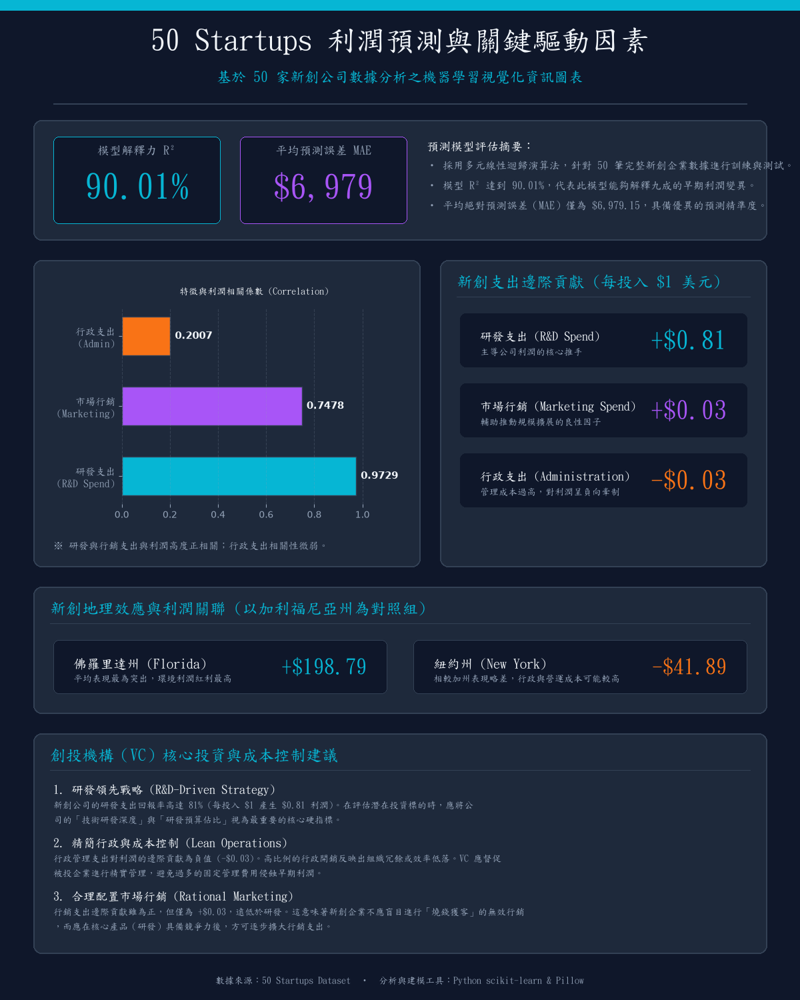

# 50 Startups 利潤預測與商務指標分析專案 (50 Startups Profit Prediction & Business Analysis)

[](https://www.python.org/)
[](https://scikit-learn.org/)
[](https://opensource.org/licenses/MIT)

本專案針對經典的 Kaggle **50 Startups** 資料集進行深入的探索性數據分析 (EDA)、特徵工程、特徵選擇、遵循 CRISP-DM 流程的模型建置，並產出精美的商業資訊圖表、技術白皮書 PDF 與簡報。

---

## 🚀 專案特點

1. **CRISP-DM 標準流程**：從商業理解、數據理解、數據準備、模型建置、評估到部署（匯出 `startup_profit_model.pkl`）。
2. **多模型比較與優化**：評估多元線性迴歸、脊迴歸與隨機森林模型，並透過網格搜尋 (GridSearchCV) 優化超參數。
3. **特徵工程與共線性消除**：使用 `ColumnTransformer` 與 `Pipeline` 整合 `StandardScaler` 和 `OneHotEncoder`，消除類別特徵 (State) 的多重共線性。
4. **自動化商業產出**：
   - 繪製高解析度中文商業資訊圖 (`feature_importance_chinese.png`)，解決傳統 AI 繪圖字型亂碼問題。
   - 自動將 Markdown 白皮書轉換為繁體中文 PDF 文件 (`whitepaper_50startups.pdf`)。
   - 自動生成簡報投影片 (`crisp_dm_regression_slides.pptx`)。

---

## 📊 核心分析與模型結果

### 1. 特徵與利潤相關性 (Correlation)
* **研發支出 (R&D Spend)**：**0.9729** (極強正相關，為核心獲利引擎)
* **市場行銷 (Marketing Spend)**：**0.7478** (強正相關)
* **行政支出 (Administration)**：**0.2007** (弱正相關)

### 2. 多元線性迴歸係數 (對原始特徵的邊際貢獻)
* **研發支出 (R&D Spend)**：每投入 $1，預期利潤增加 **+$0.81**
* **市場行銷 (Marketing Spend)**：每投入 $1，預期利潤增加 **+$0.03**
* **行政支出 (Administration)**：每投入 $1，預期利潤減少 **-$0.03** (提示需要加強管理成本控制)
* **地理位置效應** (以加州 California 為基準)：
  - 佛羅里達州 (Florida)：預期利潤增加 **+$198.79**
  - 紐約州 (New York)：預期利潤減少 **-$41.89**

### 3. 模型表現對比

| 模型 | 決定係數 $R^2$ | 平均絕對誤差 (MAE) |
|---|---|---|
| **隨機森林 (Random Forest - GridSearchCV 優化)** | **91.47%** | **$6,132** |
| **多元線性迴歸 (Linear Regression)** | **90.01%** | **$6,979** |

---

## 📁 專案檔案結構

* 📄 **核心建模與分析腳本**：
  * [crisp_dm_modeling.py](file:///c:/Users/User/Desktop/L6-new-1/crisp_dm_modeling.py)：標準 CRISP-DM 流程建模，包含隨機森林超參數搜尋，並匯出最佳模型至 `startup_profit_model.pkl`。
  * [data_analysis_step2.py](file:///c:/Users/User/Desktop/L6-new-1/data_analysis_step2.py)：資料分析與多維度統計圖表繪製腳本。
  * [calculate_feature_selection.py](file:///c:/Users/User/Desktop/L6-new-1/calculate_feature_selection.py)：特徵選擇演算法驗證 (Lasso, RFE 等)。
  * [generate_infographic.py](file:///c:/Users/User/Desktop/L6-new-1/generate_infographic.py)：讀取真實數據現場分析並動態繪製高解析度中文商業資訊圖。
* 📄 **成果文檔與產出**：
  * [whitepaper_50startups.md](file:///c:/Users/User/Desktop/L6-new-1/whitepaper_50startups.md) / [whitepaper_50startups.pdf](file:///c:/Users/User/Desktop/L6-new-1/whitepaper_50startups.pdf)：專案技術白皮書 (Markdown & 繁體中文 PDF)。
  * [feature_importance_chinese.png](file:///c:/Users/User/Desktop/L6-new-1/feature_importance_chinese.png)：生成的中文字型特徵重要度資訊圖。
  * `crisp_dm_regression_slides.pptx` / `VC_Profit_Alchemy.pptx`：商務簡報投影片。
  * [log.md](file:///c:/Users/User/Desktop/L6-new-1/log.md)：專案執行的詳細歷史日誌。
* ⚙️ **配置與環境**：
  * `50_Startups.csv`：原始數據集。
  * `requirements.txt`：Python 依賴包清單。
  * `kaiu.ttf`：用於繪製中文字型圖表與生成 PDF 的字體檔。
  * `.gitignore`：Git 版本控制排除規則。

---

## 🛠️ 安裝與執行說明

### 1. 建立虛擬環境並安裝依賴
建議使用 Python 3.8+ 虛擬環境：
```bash
# 建立虛擬環境
python -m venv .venv

# 啟用虛擬環境 (Windows)
.venv\Scripts\activate

# 安裝依賴包
pip install -r requirements.txt
```

### 2. 執行腳本
* **執行資料分析與圖表繪製**：
  ```bash
  python data_analysis_step2.py
  ```
* **執行 CRISP-DM 建模與模型導出**：
  ```bash
  python crisp_dm_modeling.py
  ```
* **生成高解析度中文資訊圖**：
  ```bash
  python generate_infographic.py
  ```
* **重新編譯白皮書 PDF**：
  ```bash
  python generate_pdf.py
  ```

---

## 📈 特徵重要度資訊圖展示



---

## 📝 專案結論與建議
1. **重研發、重行銷**：研發與行銷投入是拉動利潤增長的最核心指標，創投基金應優先關注研發投入比例高的新創。
2. **精細化管理**：行政開支在邊際上呈現負向效果，因此需要建立適當的預算管理機制。
3. **跨州市場偏好**：佛羅里達州在三州中展現出較好的利潤彈性，未來在相同條件下可優先佈局該地區的標的。
